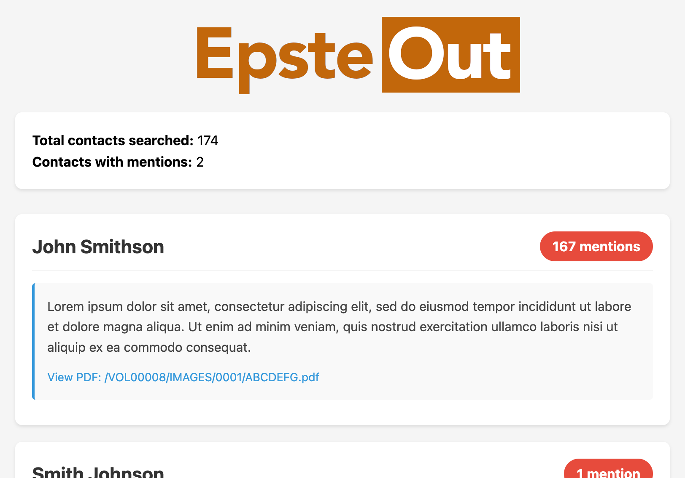

Search the publicly released Epstein court documents for mentions of your LinkedIn connections. This project is not authorized, endorsed, or otherwise affiliated with LinkedIn Corporation.

## Requirements

- Python 3.6+
- `requests` library

## Setup

```bash
git clone git@github.com:cfinke/EpsteOut.git
cd EpsteOut/
python3 -m venv project_venv
source project_venv/bin/activate
pip install -r requirements.txt
```

## Getting Your LinkedIn Contacts

1. Go to [linkedin.com](https://www.linkedin.com) and log in.
2. Click your profile icon in the top right.
3. Select **Settings & Privacy**.
4. Click **Data privacy** in the left sidebar.
5. Under "How LinkedIn uses your data", click **Get a copy of your data**.
6. Select **Connections** (or click "Want something in particular?" and check Connections). If **Connections** isn't listed as an option, choose the **Download larger data archive** option.
7. Click **Request archive**.
8. Wait for LinkedIn's email; it may take up to 24 hours.
9. Download and extract the ZIP file.
10. Locate the `Connections.csv` file.

## Usage

```bash
python EpsteOut.py --connections /path/to/Connections.csv
```

The API that EpsteOut connects to has recently required an API key to access it. Keys are available for free at https://epstein.dugganusa.com/register.html

### Options

| Flag | Description |
|------|-------------|
| `--connections`, `-c` | Path to LinkedIn Connections.csv export (required) |
| `--output`, `-o` | Output HTML file path (default: `EpsteOut.html`) |

### Examples

Basic usage:
```bash
python EpsteOut.py --connections ~/Downloads/Connections.csv
```

Custom output file:
```bash
python EpsteOut.py --connections ~/Downloads/Connections.csv --output my_report.html
```

## Reading the Output

The script generates an HTML report (`EpsteOut.html` by default) that you can open in any web browser.



The report contains:

- **Summary**: Total contacts searched and how many had mentions
- **Contact cards**: Each contact with mentions is displayed as a card showing:
  - Name, position, and company
  - Total number of mentions across all documents
  - Excerpts from each matching document
  - Links to the source PDFs on justice.gov

Contacts are sorted by number of mentions (highest first).

## Notes

- The search uses exact phrase matching on full names, so "John Smith" won't match documents that only contain "John" or "Smith" separately.
- Common names may produce false positives; review the context excerpts to verify relevance.
- Epstein files indexed by [DugganUSA.com](https://dugganusa.com)

